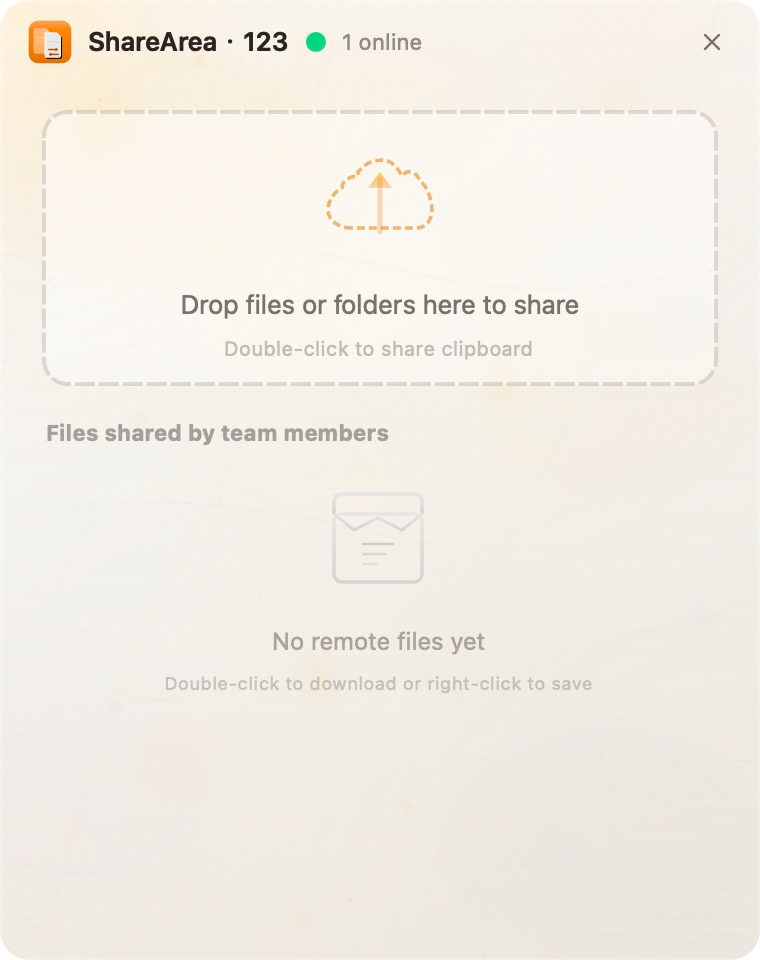

# ShareArea

[English](README.md) | [简体中文](README_zh.md)

ShareArea is a lightweight desktop app for sharing files, folders, and clipboard content on a local network with no setup required. **Transfers are unencrypted by design**, so it is intended only for trusted local networks and your own devices. Open the app on devices in the same LAN, enter the same group code, and start sharing.

<p align="center">
  
</p>

## Highlights

- Local-network file sharing with no external server
- Unencrypted transfer by design for simple, low-overhead LAN sharing
- Share files, folders, text, and clipboard text/images
- Drag and drop, or double-click, to publish content immediately
- Lightweight grouping with a simple group code
- Automatic discovery of online devices in the same network
- Clean desktop UI with system tray support

## Getting Started

1. Open ShareArea on devices connected to the same local network.
2. On first launch, enter the same group code on each device.
3. Drag files or folders into the window, double-click to share clipboard content, or copy a file and then double-click the window.
4. Other devices in the same group will immediately see the shared content and can download it directly.

## Download

Prebuilt packages are available on the [Releases](https://github.com/yinyajiang/share_area/releases) page.

- `macOS`: DMG installer
- `Windows`: Installer

### macOS Run Tip

Because the app is currently unsigned, macOS may report it as "damaged" on first launch. Run the following command in Terminal:

```bash
xattr -c /Applications/ShareArea.app/
```

## Platform Support

- `macOS`: supported
- `Windows`: supported
- `Linux`: not verified

## Build From Source

### Requirements

- `CMake 3.20+`
- `Qt 6.10.x`

### Build

```bash
cmake -B build -DCMAKE_BUILD_TYPE=Release -DCMAKE_PREFIX_PATH=/path/to/Qt/6.10.x/macos
cmake --build build --config Release --parallel
```

## License

This project is licensed under the [MIT License](LICENSE).
