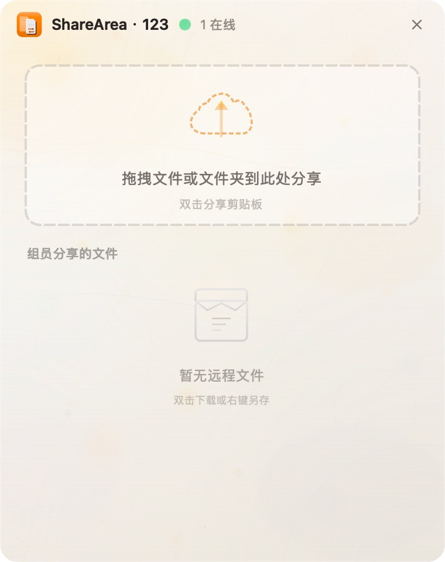

# ShareArea

[![zread](https://img.shields.io/badge/Ask_Zread-_.svg?style=flat&color=00b0aa&labelColor=000000&logo=data%3Aimage%2Fsvg%2Bxml%3Bbase64%2CPHN2ZyB3aWR0aD0iMTYiIGhlaWdodD0iMTYiIHZpZXdCb3g9IjAgMCAxNiAxNiIgZmlsbD0ibm9uZSIgeG1sbnM9Imh0dHA6Ly93d3cudzMub3JnLzIwMDAvc3ZnIj4KPHBhdGggZD0iTTQuOTYxNTYgMS42MDAxSDIuMjQxNTZDMS44ODgxIDEuNjAwMSAxLjYwMTU2IDEuODg2NjQgMS42MDE1NiAyLjI0MDFWNC45NjAxQzEuNjAxNTYgNS4zMTM1NiAxLjg4ODEgNS42MDAxIDIuMjQxNTYgNS42MDAxSDQuOTYxNTZDNS4zMTUwMiA1LjYwMDEgNS42MDE1NiA1LjMxMzU2IDUuNjAxNTYgNC45NjAxVjIuMjQwMUM1LjYwMTU2IDEuODg2NjQgNS4zMTUwMiAxLjYwMDEgNC45NjE1NiAxLjYwMDFaIiBmaWxsPSIjZmZmIi8%2BCjxwYXRoIGQ9Ik00Ljk2MTU2IDEwLjM5OTlIMi4yNDE1NkMxLjg4ODEgMTAuMzk5OSAxLjYwMTU2IDEwLjY4NjQgMS42MDE1NiAxMS4wMzk5VjEzLjc1OTlDMS42MDE1NiAxNC4xMTM0IDEuODg4MSAxNC4zOTk5IDIuMjQxNTYgMTQuMzk5OUg0Ljk2MTU2QzUuMzE1MDIgMTQuMzk5OSA1LjYwMTU2IDE0LjExMzQgNS42MDE1NiAxMy43NTk5VjExLjAzOTlDNS42MDE1NiAxMC42ODY0IDUuMzE1MDIgMTAuMzk5OSA0Ljk2MTU2IDEwLjM5OTlaIiBmaWxsPSIjZmZmIi8%2BCjxwYXRoIGQ9Ik0xMy43NTg0IDEuNjAwMUgxMS4wMzg0QzEwLjY4NSAxLjYwMDEgMTAuMzk4NCAxLjg4NjY0IDEwLjM5ODQgMi4yNDAxVjQuOTYwMUMxMC4zOTg0IDUuMzEzNTYgMTAuNjg1IDUuNjAwMSAxMS4wMzg0IDUuNjAwMUgxMy43NTg0QzE0LjExMTkgNS42MDAxIDE0LjM5ODQgNS4zMTM1NiAxNC4zOTg0IDQuOTYwMVYyLjI0MDFDMTQuMzk4NCAxLjg4NjY0IDE0LjExMTkgMS42MDAxIDEzLjc1ODQgMS42MDAxWiIgZmlsbD0iI2ZmZiIvPgo8cGF0aCBkPSJNNCAxMkwxMiA0TDQgMTJaIiBmaWxsPSIjZmZmIi8%2BCjxwYXRoIGQ9Ik00IDEyTDEyIDQiIHN0cm9rZT0iI2ZmZiIgc3Ryb2tlLXdpZHRoPSIxLjUiIHN0cm9rZS1saW5lY2FwPSJyb3VuZCIvPgo8L3N2Zz4K&logoColor=ffffff)](https://zread.ai/yinyajiang/share_area)

[English](README.md) | [简体中文](README_zh.md)


<p align="center">
  
</p>

ShareArea 是一个轻量级桌面应用，用于在本地局域网中分享文件、文件夹和剪贴板内容，无需配置。**传输不加密**，仅建议在可信任的本地网络和你自己的设备之间使用。只要在同一局域网中的设备上打开应用，输入相同的识别码，即可开始分享。

## 功能亮点

- 基于局域网的点对点分享，无需外部服务器
- 默认不加密传输，专注简单、低开销的局域网分享
- 支持分享文件、文件夹、文本和剪贴板文本和图片
- 拖拽或双击即可立即发布内容
- 通过简单识别码进行轻量分组
- 自动发现同一网络中的在线设备
- 简洁桌面界面，支持系统托盘

## 开始

1. 在连接到同一局域网的设备上打开 ShareArea。
2. 首次启动时在每台设备上输入相同的识别码。
3. 将文件或文件夹拖入窗口，或双击分享剪贴板内容，或拷贝文件后双击窗口。
4. 同组内的其他设备会立即看到共享内容，并可直接下载。

## 下载

预编译安装包可在 [Releases](https://github.com/yinyajiang/share_area/releases) 页面获取。

- `macOS`：DMG 安装包
- `Windows`：安装程序

### macOS 运行提示

由于当前应用未进行签名，首次运行时会提示“文件已损坏”。请在终端执行以下命令：

```bash
xattr -c /Applications/ShareArea.app/
```

## 平台支持

- `macOS`：支持
- `Windows`：支持
- `Linux`：未验证

## 从源码构建

### 依赖要求

- `CMake 3.20+`
- `Qt 6.10.x`

### 构建命令

```bash
cmake -B build -DCMAKE_BUILD_TYPE=Release -DCMAKE_PREFIX_PATH=/path/to/Qt/6.10.x/macos
cmake --build build --config Release --parallel
```

## 许可证

本项目基于 [MIT License](LICENSE) 开源。